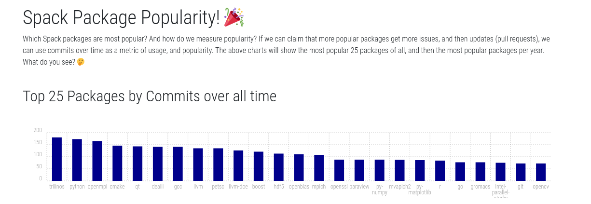

# Package Popularity



...or for this dummy example... let's assess the popularity of spack packages,
spackages! If you just want to see the output, you can [see the web interface here](https://vsoch.github.io/package-popularity/).

We first define popularity in two different ways:

 - popular as in frequency of development, which we can measure in commits that edit the package file.
 - popular as in issues, which could reflect usage or just quality of the original package file.
 
For the first, we can easily clone the repository once and then look at the commits.
I realized that the second is much harder to derive, because we would need to link
a specific commit or pull request with a package. Arguably, the first can capture
that, as issues lead to pull requests, and pull requests lead to commits.
So this is what we will attempt to measure.

## 1. How popular are packages based on commits?

We can look at total commits over time, but that will be biased towards packages
that have been around longer. We can also look at commits per month or year, which
would be biased in the opposite direction - a package newly added might have
a bunch of commits in the first month, while an older package likely goes
for months or even years without much in terms of an update. I'll look at both
these metrics, but to try and even things out, I'll also try to assess the 
most popular packages for a given year.

### a. prepare data

We first want to use [generate.sh](generate.sh) to create data dump of commits
based on package names. This script requires the path to the spack repository,
along with the folder to search in, and the pattern to match. For example:


```bash
# We must use the fullpath of the repository
repository=$HOME/Desktop/Code/spack
              # name      # root    # relative search folder          # file pattern
./generate.sh spack/spack $repository var/spack/repos/builtin/packages/ package.py
```

The results are written to [data/commits](data/commits) and organized by package
file.  At the time of parsing, this is the latest commit:

```
commit 0250a0d4ce921513bea05baca954fbcabf695ef4 (HEAD -> develop, origin/develop, origin/HEAD)
Author: Itaru Kitayama <ikitayama@users.noreply.github.com>
Date:   Mon May 3 01:04:18 2021 +0900

    scalasca: Update variant releases (#23383)
    
    * Add 4.6
    
    * Add Cubelib 4.6
    
    Co-authored-by: Itaru Kitayama <itaru.kitayama@riken.jp>
```

We next want to generate a summary of counts for each package, by month
and year, and render this into a template to show our results. We can
do that by:

```bash
python summarize-commits.py data/commits
```

Currently, the interface generated is [index.html](index.html). It looks like there
was a re-organization of packages, so the data from 2013 looks a little strange.
